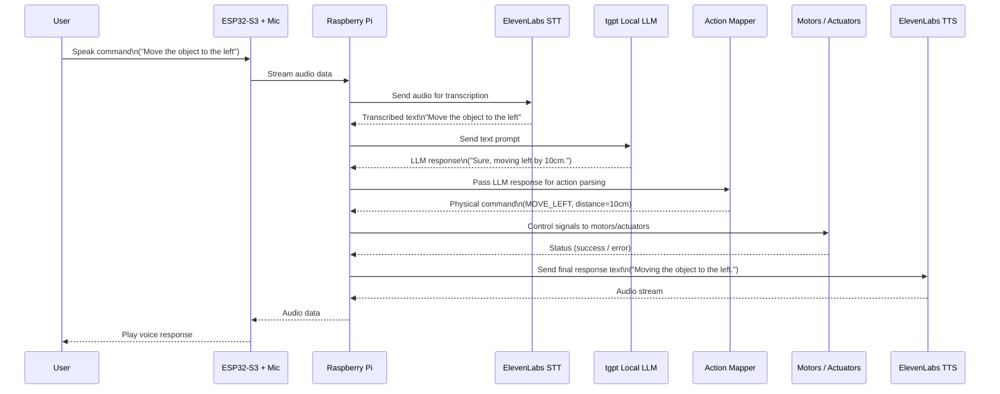

# Voice-Driven Physical Agent

> ESP32-S3 + Raspberry Pi + ElevenLabs + Local LLM (tgpt)

Turn your voice into **physical actions**.
This project lets you speak to a small ESP32-S3 device, send audio to a Raspberry Pi, interpret your command with a local LLM, and then **control real-world hardware** (motors, actuators, etc.) while speaking back to you using ElevenLabs.

---

## Table of Contents

* [Overview](#overview)
* [Core Features](#core-features)
* [High-Level Architecture](#high-level-architecture)

  * [Sequence Diagram](#sequence-diagram)
  * [Architecture Diagram](#architecture-diagram)
* [Hardware Setup](#hardware-setup)
* [Software Components](#software-components)
* [Getting Started](#getting-started)

  * [Prerequisites](#prerequisites)
  * [Clone the Repository](#clone-the-repository)
  * [Configure Environment](#configure-environment)
  * [Install Python Dependencies](#install-python-dependencies)
  * [Flash ESP32-S3 Firmware](#flash-esp32-s3-firmware)
  * [Run the Raspberry Pi App](#run-the-raspberry-pi-app)
* [How It Works (End-to-End Flow)](#how-it-works-end-to-end-flow)
* [Action Mapping](#action-mapping)
* [Customization Ideas](#customization-ideas)
* [Roadmap](#roadmap)
* [License](#license)

---

## Overview

This project is a **voice interface for physical objects**.

1. You talk to an **ESP32-S3** device with a microphone.
2. The ESP32-S3 streams the audio to a **Raspberry Pi** over Wi-Fi.
3. The Raspberry Pi sends audio to **ElevenLabs Speech-to-Text (STT)** and gets back text.
4. The text is passed to a local **tgpt LLM**, which:

   * Understands intent.
   * Generates a friendly natural-language reply.
   * Produces a **structured action** (e.g., “move left 10 cm”).
5. The Pi maps that action to **motor/actuator commands** and drives the hardware.
6. A reply sentence is sent to **ElevenLabs Text-to-Speech (TTS)** and spoken back to the user.

The result is a conversational controller for the physical world.

---

## Core Features

* 🎙️ **Hands-free voice input** via ESP32-S3 + microphone.
* 🧠 **Local LLM (tgpt)** for intent parsing and custom logic.
* 🗣️ **ElevenLabs STT + TTS** for high-quality speech I/O.
* ⚙️ **Action mapping layer** to translate natural language → device commands.
* 🔌 Modular hardware: swap motors, actuators, or even the whole robot, keep the same voice interface.

---

## High-Level Architecture

### Sequence Diagram



### Architecture Diagram

```mermaid
flowchart LR
    subgraph Device[ESP32-S3 Device]
        MIC[Microphone] --> ESP[ESP32-S3]
    end

    subgraph Edge[Edge Computer (Raspberry Pi)]
        AReceiver[Audio Receiver]
        STTClient[ElevenLabs STT Client]
        LLMClient[tgpt Local LLM Client]
        ActionMap[Action Mapping Layer]
        MotorCtrl[Motor / GPIO Controller]
        TTSClient[ElevenLabs TTS Client]
        AudioOut[Audio Streamer]
    end

    subgraph Cloud[Cloud Services]
        ESTT[ElevenLabs STT API]
        ETTS[ElevenLabs TTS API]
    end

    User((User)) --> MIC
    ESP -->|Audio via Wi-Fi| AReceiver

    AReceiver --> STTClient --> ESTT --> STTClient
    STTClient -->|Transcribed Text| LLMClient
    LLMClient -->|Reply + Intent| ActionMap
    ActionMap --> MotorCtrl -->|Signals| Motor[Motors / Actuators]

    ActionMap --> TTSClient --> ETTS --> TTSClient
    TTSClient --> AudioOut -->|Audio via Wi-Fi| ESP
    ESP -->|Speaker| User
```

---

## Hardware Setup

Minimum setup:

* **ESP32-S3** development board

  * Built-in Wi-Fi
  * I2S microphone (e.g., INMP441 or similar)
* **Raspberry Pi** (4 / 5 or similar)

  * Python 3
  * Internet access (for ElevenLabs)
* **Motors / Actuators**

  * DC motor / stepper / servo
  * Matching motor driver (e.g. L298N, DRV8833, or a servo controller)
* **Power supply** appropriate for motors and electronics
* Optional: Speaker connected to ESP32-S3 or Raspberry Pi for playback.

---

## Software Components

**ESP32-S3 (Firmware)**

* Configures Wi-Fi.
* Captures audio from microphone (I2S).
* Streams audio to Raspberry Pi (HTTP/WebSocket/UDP).
* Receives audio data (TTS output) and plays it through a speaker (if attached).

**Raspberry Pi (Python App)**

Modules can be structured like:

* `audio_receiver.py` — receives audio stream from ESP32-S3.
* `elevenlabs_stt_client.py` — sends audio to ElevenLabs STT and returns transcribed text.
* `tgpt_client.py` — connects to local tgpt LLM (HTTP/CLI).
* `action_mapper.py` — turns LLM output into structured commands (`MOVE_LEFT`, etc.).
* `motor_controller.py` — drives GPIO / PWM for motors and actuators.
* `elevenlabs_tts_client.py` — sends text to ElevenLabs TTS and gets audio.
* `audio_streamer.py` — streams TTS audio back to ESP32-S3 or plays it locally.

---

## Getting Started

### Prerequisites

* ElevenLabs account + API key.
* tgpt (local LLM) installed and running (e.g. as a CLI or HTTP server).
* Raspberry Pi environment with:

  * Python 3.9+
  * `pip`
* Toolchain for ESP32-S3:

  * Arduino IDE **or** ESP-IDF **or** PlatformIO.

---

### Clone the Repository

```bash
git clone https://github.com/<your-username>/voice-physical-agent.git
cd voice-physical-agent
```

*(Update the URL to your actual repo.)*

---

### Configure Environment

Create a `.env` file in the project root:

```bash
ELEVENLABS_API_KEY=your_api_key_here
ELEVENLABS_STT_MODEL=your_stt_model_id
ELEVENLABS_TTS_VOICE_ID=your_voice_id_here

TGPT_ENDPOINT=http://localhost:8080   # or any endpoint / CLI wrapper you use
```

Example `config.yaml` for motors and actions:

```yaml
motors:
  left_motor:
    pins:
      enable: 18
      in1: 23
      in2: 24
    default_speed: 0.7

actions:
  MOVE_LEFT:
    motor: left_motor
    duration_per_cm: 0.2
  MOVE_RIGHT:
    motor: left_motor
    duration_per_cm: 0.2
```

---

### Install Python Dependencies

On the Raspberry Pi:

```bash
pip install -r requirements.txt
```

Example libraries you might include in `requirements.txt`:

```text
python-dotenv
requests
pyaudio
sounddevice
PyYAML
```

Add or remove packages depending on your actual implementation.

---

### Flash ESP32-S3 Firmware

1. Open the firmware project in **Arduino IDE** / **PlatformIO** / **ESP-IDF**.
2. Set your Wi-Fi credentials and Raspberry Pi IP address in the firmware config.
3. Build and upload to the ESP32-S3.
4. Open the serial monitor to ensure:

   * Wi-Fi connects successfully.
   * Audio starts streaming to the Raspberry Pi.

---

### Run the Raspberry Pi App

On the Raspberry Pi:

```bash
python main.py
```

`main.py` should:

1. Start the audio receiver server.
2. Connect to ElevenLabs STT and TTS.
3. Connect to tgpt.
4. Initialize GPIO and motor drivers.

Once running, you can start speaking into the ESP32-S3 mic.

---

## How It Works (End-to-End Flow)

1. **User speaks**:

   > “Move the object slightly to the left.”

2. **ESP32-S3** records audio and streams it to the Raspberry Pi.

3. **Raspberry Pi → ElevenLabs STT**

   * Sends audio to STT API.
   * Receives:

     ```text
     "Move the object slightly to the left"
     ```

4. **Raspberry Pi → tgpt LLM**

   * Sends a prompt including the recognized text and instructions for a structured response.
   * Example tgpt output:

     ```json
     {
       "user_reply": "Got it. I’ll move the object a bit to the left.",
       "action": {
         "type": "MOVE_LEFT",
         "amount": 10,
         "unit": "cm"
       }
     }
     ```

5. **Action Mapping**

   * `action_mapper.py` reads the JSON and decides:

     * Which motor to drive.
     * How long / how far to move.

6. **Motor Control**

   * `motor_controller.py` toggles GPIO pins and drives the motor.

7. **TTS Reply**

   * The text `"Got it. I’ll move the object a bit to the left."` is sent to ElevenLabs TTS.
   * Audio is returned and streamed back to the ESP32-S3.

8. **Playback**

   * ESP32-S3 (or Pi) plays the voice response through a speaker.

---

## Action Mapping

The action mapping layer is where language becomes a concrete command.

Example design:

* LLM always returns JSON with two fields:

  * `user_reply`: friendly English sentence.
  * `action`: machine-friendly object.

Example:

```json
{
  "user_reply": "Okay, rotating 30 degrees to the left.",
  "action": {
    "type": "ROTATE",
    "direction": "LEFT",
    "amount": 30,
    "unit": "degrees"
  }
}
```

`action_mapper.py` can:

* Validate the JSON.
* Clamp values (e.g., max 90°).
* Map `type` + `direction` into GPIO sequences.

